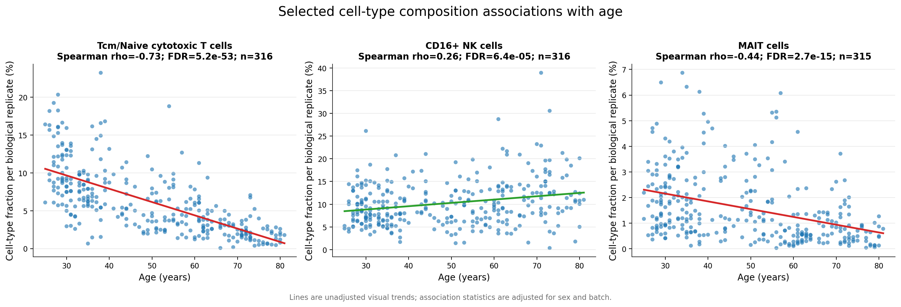
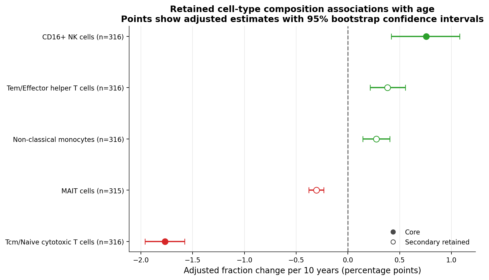
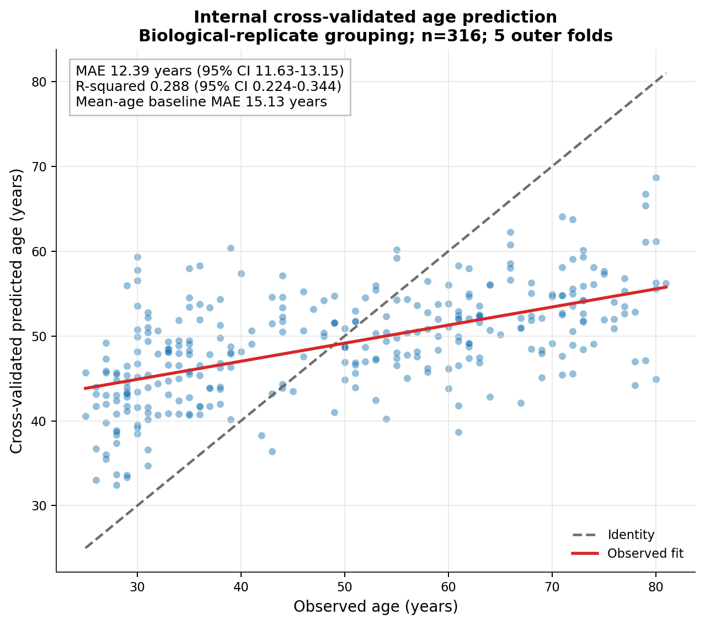

# Immune Aging Single-Cell

[](https://github.com/richard2049/immune-aging-single-cell/actions/workflows/ci.yml)

Modular Snakemake pipeline for PBMC single-cell RNA-seq analysis focused on immune aging.

Stack: `scanpy` + `scvi-tools` + `CellTypist`.

## Key Properties
- Reproducible, config-driven workflow design (`Snakemake` + YAML configs).
- Memory-safe single-cell processing (sparse counts, no dense graph conversion).
- Standard single-cell analysis stages: QC, doublet removal, scVI latent
  modeling, clustering, and automated annotation.
- Structured, inspectable outputs: `.h5ad` intermediates, figures, and summary
  tables.

## Documentation
- [Documentation index](docs/README.md)
- [Analysis decisions](docs/analysis_decisions.md)
- [Real-data guide](docs/real_data.md)
- [Scientific verification contract](docs/verification_contract.md)

## Pipeline
1. `ingest` -> `results/01_raw.h5ad`
2. `metadata` -> `results/01_meta.h5ad` (obs ID parsing + optional external metadata merge)
3. `qc` -> `results/02_qc.h5ad`
4. `doublets` (SOLO) -> `results/03_nodoublets.h5ad`
5. `scvi_train` -> `results/04_scvi.h5ad` + `results/models/scvi_model/`
6. `cluster` -> `results/05_clustered.h5ad`
7. `annotate` (CellTypist) -> `results/06_annotated.h5ad`
8. `report` -> figures + tables + `results/reports.done`
9. `composition_age` -> age-stratified composition figures + trend tables
10. `signature_age` -> donor-level signature trends vs age (figures + stats)
11. `age_prediction` -> chronological age prediction from donor-celltype scVI embeddings
12. `sensitivity_age` -> parameter-sensitivity runs for age analyses
13. `supplementary_age` -> supplementary summary figures for effect sizes and stability

## Quickstart (Demo)
```bash
conda env create -f environment.yml
conda activate immune-aging-scvi

snakemake -s workflows/Snakefile -c 1 --configfile config/demo.yaml
```

For an existing environment, apply the tracked dependency contract explicitly:

```powershell
$mamba = Join-Path ((conda info --base).Trim()) "Library\bin\mamba.exe"
if (-not (Test-Path $mamba)) { throw "mamba.exe not found at $mamba" }
& $mamba env update -n immune-aging-scvi -f environment.yml --prune
if ($LASTEXITCODE -ne 0) { throw "Environment update failed; do not run validation in the stale environment." }
conda activate immune-aging-scvi
python -c "import scanpy, scvi, celltypist, xgboost; print(scanpy.__version__, scvi.__version__, celltypist.__version__, xgboost.__version__)"
if ($LASTEXITCODE -ne 0) { throw "Required scientific packages are unavailable." }
```

The update can require a full dependency solve. Do not run it concurrently with
Snakemake or another conda operation. If channel downloads fail, follow the
network checks in `docs/troubleshooting.md`; do not continue with workflow
validation in the stale environment.

Windows/PowerShell equivalent:
```powershell
python -m snakemake -s workflows/Snakefile -c 1 --configfile config/demo.yaml
```

Run a specific target:
```powershell
python -m snakemake -s workflows/Snakefile -c 1 age_prediction --configfile config/gse164378_pilot.yaml
```

## Maintenance Rebuilds

The demo command above is a smoke-test path, not a rebuild of the current
GSE164378 analysis. The maintained one-million-cell result path has two
sequential stages:

1. `workflows/Snakefile` creates the one-million-cell annotated checkpoint and provisional
   outputs under `results/gse164378_full/`.
2. `workflows/Snakefile.replicate_corrected` reuses that checkpoint and creates
   the authoritative replicate-corrected outputs under
   `results/gse164378_full_replicate_corrected/`.

Run the following from the repository root in an activated
`immune-aging-scvi` environment. Keep `-c 1` for the conservative memory-safe
route, do not run the two Snakemake commands concurrently, and ensure Docker
Desktop is available for the pinned edgeR stages.

```powershell
$requiredInputs = @(
    "data/raw/raw_counts_h5ad/pbmc_gex_raw_with_var_obs.h5ad",
    "data/raw/raw_counts_h5ad/all_pbmcs/all_pbmcs_metadata.csv"
)

foreach ($path in $requiredInputs) {
    if (-not (Test-Path -LiteralPath $path)) {
        throw "Required input not found: $path"
    }
}

docker --context desktop-linux image inspect `
    immune-aging-edger:bioc-3.23-edger-4.10.1 | Out-Null
if ($LASTEXITCODE -ne 0) {
    throw "The pinned edgeR Docker image is unavailable."
}

$logDir = "results/logs"
New-Item -ItemType Directory -Force -Path $logDir | Out-Null
$logPath = Join-Path $logDir (
    "maintenance_rebuild_{0}.log" -f (Get-Date -Format "yyyyMMdd_HHmmss")
)

Start-Transcript -Path $logPath
try {
    python -m snakemake `
        -s workflows/Snakefile `
        -c 1 `
        --configfile config/gse164378_1m.yaml `
        --rerun-incomplete `
        --printshellcmds

    if ($LASTEXITCODE -ne 0) {
        throw "The one-million-cell workflow failed; do not run the corrected stage."
    }

    python -m snakemake `
        -s workflows/Snakefile.replicate_corrected `
        -c 1 `
        all pseudobulk_robustness_evidence `
        --configfile config/gse164378_corrected.yaml `
        --rerun-incomplete `
        --printshellcmds

    if ($LASTEXITCODE -ne 0) {
        throw "The replicate-corrected workflow failed."
    }
}
finally {
    Stop-Transcript
}
```

The explicit `pseudobulk_robustness_evidence` target extends the corrected
workflow's default `all` target through pseudobulk aggregation, edgeR modeling,
technical validation, sensitivity models, and bounded evidence preparation.
Snakemake normally reruns only incomplete or out-of-date jobs. Add `--forceall`
to both commands only for a deliberate complete recomputation, including scVI
training and annotation.

If `results/gse164378_full/06_annotated.h5ad` remains a validated immutable
checkpoint, run only the second Snakemake command to regenerate downstream
replicate-corrected results. After either route, inspect validation reports and
`git diff -- docs`; do not publish regenerated reports or claims without the
required scientific review.

## Validation
Use the project conda environment before running workflow checks. The tracked
environment is CPU-first for portability.

```powershell
python -m compileall src workflows
python -m unittest discover -s tests -v
python -m snakemake -s workflows/Snakefile -c 1 -n --configfile config/demo.yaml
```

GitHub Actions applies the same Ruff and compilation checks, runs the unit-test
suite in the tracked scientific environment, and constructs the demo workflow
DAG. Docker-qualified edgeR tests, real-data execution, and full analysis runs
remain explicit validation steps outside routine CI. A passing CI run confirms
the automated technical checks only; it does not establish biological validity.

Development-only linting is kept outside the scientific runtime environment:

```powershell
$base_python = Join-Path ((conda info --base).Trim()) "python.exe"
& $base_python -m venv .venv-dev
$dev_python = Join-Path (Resolve-Path ".venv-dev") "Scripts\python.exe"
& $dev_python -m pip install -r requirements-dev.txt
& $dev_python -m ruff check src tests workflows
& $dev_python -m ruff format --check src tests workflows
```

Enable GPU training only after installing a CUDA-enabled PyTorch build and
validating CUDA locally, then set `scvi.accelerator: gpu` in the config profile
you are running.

## Replicate-Corrected GSE164378 Results
Review of the source metadata showed that the original `donor_id` field was
reused across pools. Donor-level analyses were therefore repeated using
`Tube_id` as `biological_replicate_id`. The source metadata contained 317
biological replicates, of which 316 met the requirements for the main
composition and prediction analyses.

After adjustment for sex and batch, a 10-year difference in age was associated
with a 1.77 percentage-point lower Tcm/Naive cytotoxic T-cell fraction (95% CI
-1.96 to -1.58; FDR 5.15e-53), a 0.30 percentage-point lower MAIT-cell
fraction (95% CI -0.38 to -0.23; FDR 2.71e-15), and a 0.76 percentage-point
higher CD16+ NK-cell fraction (95% CI 0.42 to 1.08; FDR 6.43e-5). These are
cross-sectional associations between participants, not estimates of
within-person change or causal effects of aging. Tcm/Naive cytotoxic T cells
form a combined annotation category rather than a single resolved subtype.



*Cell-type fractions per biological replicate plotted against age for the three
associations selected for the main figure. Lines are unadjusted linear
summaries included for visualization; Spearman rho and FDR are from analyses
adjusted for sex and batch. Tcm/Naive cytotoxic T cells form a combined
annotation category. The associations are cross-sectional and do not establish
causality.*

The retained composition results are summarized below on a common
percentage-point scale. The two filled markers identify the core results shown
above; open markers indicate secondary retained associations.



*Sex- and batch-adjusted differences in cell-type fraction per 10-year
difference in age for all retained composition associations. Points show
effect estimates in percentage points, and bars show 95% bootstrap confidence
intervals.*

The scVI-derived features also retained an age-related predictive signal. In
nested regressor cross-validation grouped by biological replicate, the selected model
had a donor-level mean absolute error of 12.39 years (95% CI 11.63 to 13.15),
compared with 15.13 years for a fold-specific mean-age baseline. This is modest
internal, transductive predictive performance: the `X_scVI` representation was
learned once from the full cohort before the grouped regressor evaluation. It
has not been validated end to end in unseen donors, as an aging clock, or as a
clinical biomarker.



*Observed donor age and cross-validated predicted age for the selected model.
Outer regressor folds were grouped by biological replicate; the upstream scVI
representation was fitted once on the full cohort. The identity line represents
perfect prediction, while the fitted line shows the relationship observed in
the held-out predictions. Reported metrics describe internal cross-validation
of the regressor and do not establish end-to-end generalization, external
validity, or clinical utility.*

Several predefined gene-set scores were associated with age, but these results
remain exploratory. Signature scores are proxies for the configured gene sets
and do not directly measure pathway activation or suppression.

The donor-aware, cell-type-specific pseudobulk differential-expression module
is implemented as a targeted corrected-profile stage. Its approved contract
uses summed raw counts, continuous age, replicate-level inference, and a
version-checked `edgeR` quasi-likelihood model. The container runtime has
passed a bounded synthetic qualification test. The full corrected-replicate
GSE164378 run and automated technical validation are complete, but the
gene-level results have not yet undergone biological interpretation. A
pre-specified robustness audit completed 212 sensitivity models, recorded
three non-estimable scenarios explicitly, and produced a bounded 249-row queue
for later human review. It did not approve genes or pathways, and no gene-level
claims are currently presented. See `docs/pseudobulk_de.md`,
`docs/pseudobulk_de_design.md`, and `docs/pseudobulk_robustness_audit.md`.

## Report Outputs
Generated by `src/report.py`:
- `results/figures/umap_leiden.png`
- `results/figures/umap_cell_type.png`
- `results/figures/qc_distributions.png`
- `results/figures/cell_type_composition.png`
- `results/tables/cell_type_counts.csv`
- `results/tables/cell_type_fractions.csv`
- `results/tables/cluster_celltype_crosstab.csv`

Generated by `src/composition_age.py`:
- `results/figures/age_celltype_composition_by_bin.png`
- `results/figures/age_celltype_top_trends.png`
- `results/tables/age_celltype_fraction_by_donor.csv`
- `results/tables/age_celltype_trend_stats.csv`

Generated by `src/signature_age.py`:
- `results/figures/signature_age_heatmap.png`
- `results/figures/signature_age_top_associations.png`
- `results/tables/signature_scores_by_donor_celltype.csv`
- `results/tables/signature_age_associations.csv`
- `results/tables/signature_gene_coverage.csv`

Generated by `src/age_prediction.py`:
- `results/figures/age_pred_observed_vs_predicted.png`
- `results/figures/age_pred_mae_by_celltype.png`
- `results/tables/age_pred_cv_predictions.csv`
- `results/tables/age_pred_metrics.csv`
- `results/tables/age_pred_model_comparison_summary.csv`
  - `age_pred_metrics.csv` compares candidate models under identical
    donor-grouped cross-validation folds.
  - `age_pred_model_comparison_summary.csv` adds fold-level winner counts and bootstrap CI for paired MAE deltas vs best Ridge.

Generated by `src/sensitivity_age.py`:
- `results/sensitivity_age/sensitivity_manifest.csv`
- `results/sensitivity_age/sensitivity_summary.csv`

Generated by `src/supplementary_age_plots.py`:
- `results/figures/supp_age_effect_ci_forest.png`
- `results/figures/supp_age_sensitivity_stability.png`

## Real-Data Mode
Copy `config/custom.example.yaml` to an ignored local profile before adapting
it to a new dataset:

```powershell
Copy-Item config/custom.example.yaml config/custom.local.yaml
```

Set `cfg_path: config/custom.local.yaml`, then review the input path, metadata
schema, biological-replicate field, covariates, thresholds, and output
directory. The tracked GSE164378 profiles record fixed study runs and are not
generic templates.

Detailed schema and ingestion notes are in `docs/real_data.md`; profile roles
and inheritance are documented in `docs/configuration.md`.

## Notes
- Default configs use CPU for portability on Windows/macOS/Linux and match the
  CPU-only PyTorch environment in `environment.yml`.
- Large data files and `results/` are gitignored.
- Use `config/gse164378_pilot.yaml` for the bounded 50,000-cell GSE164378
  smoke run and `config/gse164378_1m.yaml` for the accepted one-million-cell
  checkpoint. An uncapped analysis is not currently a tracked run profile.
- Store figures referenced by the README under `docs/assets/`
  (`.png/.jpg/.jpeg/.webp`).
- Keep `.snakemake/`, raw downloads, and generated artifacts out of version control.

## Citation
Citation metadata for release `v0.1.0` is provided in
[`CITATION.cff`](CITATION.cff).

## License
Unless otherwise noted, original code and documentation in this repository are
available under the [BSD 3-Clause License](LICENSE). External datasets,
pretrained models, and third-party software remain subject to their original
licenses and terms.
